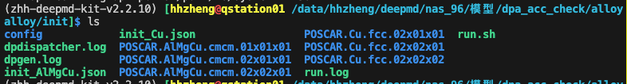

## train
已完成在qstation01上训练的模型，与qlab01上的模型相比，结果差异在0.01meV

## 测试的脚本
统计力的3个分量的误差：/home/nas_zjm/材料科学基座模型/模型/dpa_acc_check/alloy/run/dpdata_en.py

该文件描述了再报告中计算误差的计算方法，那我也用这个脚本获得模型的数据。

报告中的数据在:
nas(/data/hhzheng/deepmd/nas_96): /模型/dpa_acc_check/alloy/init

在该数据集下，有 box.raw, coord.raw, energy.raw, force.raw这些文件记录了使用VASP计算的能量，在dataset_all中，没有这些文件。

在qstation01上可以直接访问nas数据（已挂载）

scaling的情况：
使用geometry文件夹下的supercell，比较deepmd在qstation01，tc6001, qlab01上的情况。

## qlab01上的模型在qstation01上可以测试使用吗？
可以。查看report_almgcu.ipynb

## test-case -2
计算的结果：

dp_AlMgCu.cmcm_error.csv , dp_analyse_AlMgCu.cmcm_error.csv

| System | Cell     | Atoms | Nframes | Energy RMSE [eV/atom] | Force x   | Force y   | Force z   |
|--------|----------|-------|---------|-----------------------|-----------|-----------|-----------|
| AlMgCu | 01x01x01 | 16    | 20      | 44.23779840599682 |-49.227870204813534|52.163800037478964|-52.101199718619384 |
| AlMgCu | 02x01x01 |   32    |   20      |  41.95128319584735 | -41.61872340079182 | -44.265066799345774 | 43.45331903042421|
| AlMgCu | 02x02x01 |   64    |    20     |   34.6127152281096 | -39.429568534059925 | -38.32527491047273 | -38.49517166261273 |		

##